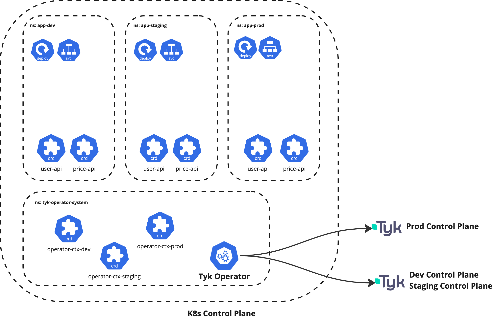

# tyk-cicd-demo

This is a playground for demostrating how to control deployment of APIs in CI/CD use Tyk Operator or Tyk Sync.

## Example 1 - Deploying your application and API configurations using Helm and ArgoCD
In this example, you'll use Helm to package your applications with API configurations. The Helm Chart and manifests are committed to Git. ArgoCD will automatically re-deploy (sync) your Helm Chart.

1. Environment setup

First, setup your Tyk environments for testing. In this demo, we assume 3 environments (dev, staging, prod). Then, setup some local Kubernetes clusters where you can deploy ArgoCD, Tyk Operator, and the applications.



Spin up two local clusters:
```
minikube start -p staging
minikube start -p production
```

To switch cluster:
```
kubectx staging
kubectx production
```

2. Install Tyk Operator
Follow [`operator-configs`](./operator-configs/) to install Tyk Operator and configure OperatorContext to connect to different Tyk environments.

3. Install ArgoCD
[Install ArgoCD](https://argo-cd.readthedocs.io/en/stable/getting_started/)

4. Example HTTP API - See [httpbin](./httpbin/)

5. Example OAS HTTP API - See [petstore](./petstore/)

6. To enable GitOps management of your application and APIs, create some ArgoCD Applications, e.g.:

```
kubectl apply -f argocd/httpbin-applicationset.yaml
```

This will automatically deploy applications to multiple environments during ArgoCD synchronization.